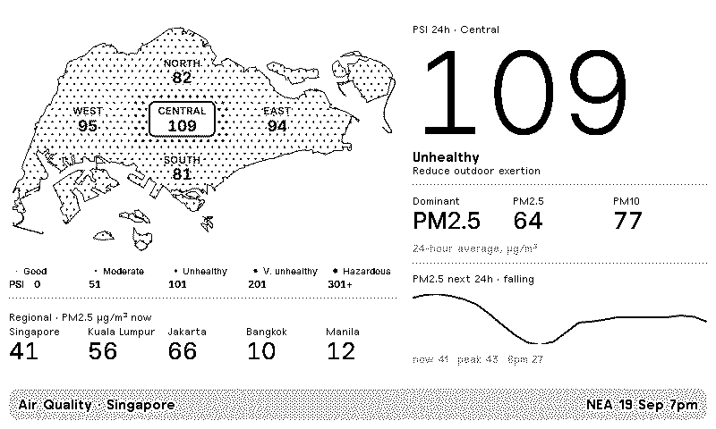
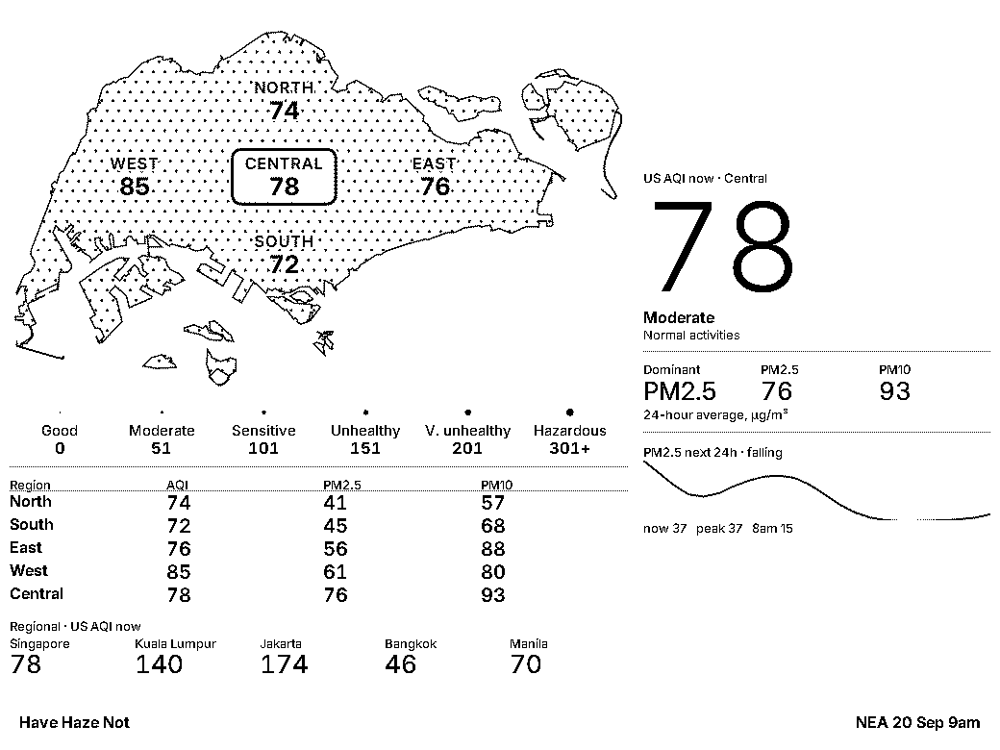
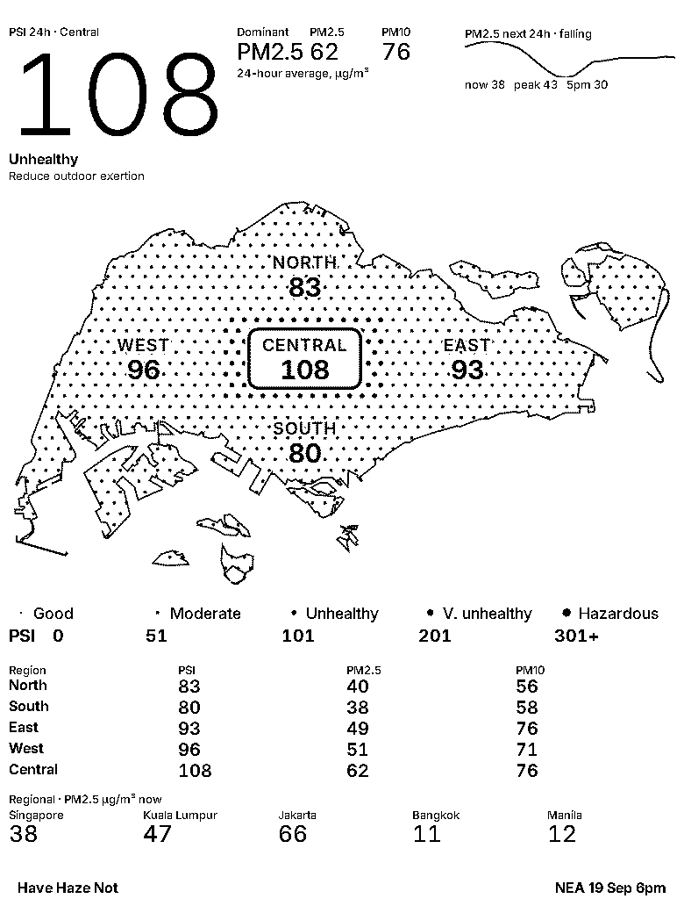
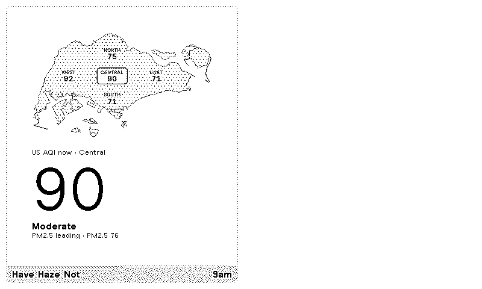

# Have Haze Not

A Singapore air quality tracker for [TRMNL](https://trmnl.com).

A halftone map of all five NEA reporting regions, the headline reading for
your region with the pollutant driving it, a 24-hour PM2.5 forecast, and how
the neighbouring capitals compare — on one e-ink screen, sized to whichever
TRMNL panel it lands on. Readable as US AQI, NEA PSI or raw PM2.5.



No server and no hosting: TRMNL polls the public APIs directly and the Liquid
templates do the rest. It works with no account at all — an optional, free
aqicn.org token only changes where the US AQI comes from.

## Devices

The layout is proportional rather than pixel-fixed, so it fills whatever panel
it lands on. TRMNL renders OG at 800x480 logical pixels and X at 1040x780
(1872x1404 at `--pixel-ratio: 1.8`), with the BYOD sizes in between.



Portrait is its own case. The width is about an OG's, but there are another
500px of height, and side by side the columns used barely half the panel. The
columns stack instead: the map takes the full width, which suits a shape that
is wide and shallow, and the readings sit above it as a row. That took a
fill of 57% to 96%.



One trap worth knowing if you touch this: the framework's `.column` sets
`width: 0` and leans on flex-basis to size it. Along a row that is fine, but
once the columns stack, width becomes the cross axis and `align-items:
stretch` cannot undo an explicit zero — every column collapses to nothing.
The override needs three classes to outrank `.trmnl .column`.

The X is 4:3 where the OG is 5:3 and carries 2.1x the pixel area, so it has
width and height a layout drawn for the OG has no content for. That space is
spent on content rather than padding:

- below a 3:2 aspect ratio the map column widens, so the extra width grows the
  map rather than the margins
- a per-region table of PSI, PM2.5 and PM10 appears in the same query. It is
  in the markup on every panel and simply not laid out on the OG, where there
  is no room for it
- the forecast chart absorbs the shorter column's spare height, up to a cap

Spreading the OG's blocks out to fill instead was tried and rejected: it opens
a ~150px void in the left column, and stretching the forecast far enough to
reach the bottom turns a 13ug/m3 drift into a cliff.

The aspect-ratio rule is progressive — if a renderer's viewport does not match
the panel it simply never fires, and the default split still lays out
correctly. `tests/test_layout.py` fails the build on a pixel width in a column,
a pixel-sized SVG, or a nested `.layout`.

## Where the data comes from

| Source | Used for | Key needed |
|---|---|---|
| [data.gov.sg real-time PSI](https://data.gov.sg/datasets/d_fe37906a0182569d891506e815e819b7/view) (NEA) | 24-hour PSI, PM2.5/PM10 and pollutant sub-indices, five regions | no |
| [data.gov.sg PM2.5](https://api-open.data.gov.sg/v2/real-time/api/pm25) (NEA) | hourly PM2.5, same five regions — what the AQI is derived from | no |
| [Open-Meteo Air Quality](https://open-meteo.com/en/docs/air-quality-api) | 24-hour PM2.5 forecast, current PM2.5 and US AQI for the regional row | no |
| [aqicn.org](https://aqicn.org/json-api/doc/) | measured US AQI per region | optional token |
| [geoBoundaries](https://www.geoboundaries.org/) gbOpen SGP ADM0 | the coastline | n/a, baked in |

NEA is the source for everything inside Singapore because it is the official
measurement and it reports five separate regions. Open-Meteo's air-quality
model runs on a ~11 km grid, which cannot tell one part of Singapore from
another — two points 8 km apart return the same cell — so it is used only for
the forecast and for cities far enough apart to land in different cells.

## How the map works

There is no server to render tiles, so the map is a constant in the template.
`tools/build_map.py` takes the coastline polygon and NEA's five reporting
coordinates and bakes three Liquid variables into `src/shared.liquid`:

- `map_coast` — one SVG path covering the main island, Tekong, Ubin, Jurong
  Island, Sentosa and the southern islands
- `map_layers` — the land sampled on a hex lattice, each dot assigned to its
  nearest NEA reporting point, grouped into five layers
- `map_labels` — where each region's label sits

At render time the template loops the five layers and picks one dot radius per
layer from that region's current PSI. Bigger dots mean a worse band, which is
what the legend under the map spells out. Halftone dots were chosen over grey
fills because the panel is 1-bit.

The region shapes are therefore the Voronoi cells of NEA's five reporting
points clipped to land — an approximation of NEA's regions, not their official
boundaries, which are not published as geometry.

## Install

Clone the plugin into your TRMNL account with [`trmnlp`](https://github.com/usetrmnl/trmnlp).
`bin/trmnlp` uses a locally installed gem if you have Ruby ≥ 3.4 and falls back
to Docker otherwise, so neither is a hard requirement beyond one of the two.

```sh
bin/trmnlp login
make push          # creates the plugin; copy the new id into src/settings.yml
```

Add the returned `id:` to `src/settings.yml` so later pushes update the same
plugin instead of creating a new one each time.

Prefer the web editor? Create a Private Plugin with strategy **Polling**, paste
both URLs from `src/settings.yml` into the Polling URL field (one per line),
and paste each `src/*.liquid` file into the matching layout — remembering that
`shared.liquid` has to be prepended to each one by hand, since the web editor
has no shared file.

## Settings

**Scale** — which index the screen speaks in. Defaults to **US AQI**.

| Choice | Singapore regions | Regional cities |
|---|---|---|
| US AQI | aqicn.org, or derived from NEA's hourly PM2.5 without a token | Open-Meteo's `us_aqi` |
| NEA PSI | NEA's published PSI | derived from modelled PM2.5 |
| PM2.5 | NEA's 24-hour average, µg/m³ | Open-Meteo's PM2.5, µg/m³ |

No free source publishes an AQI per Singapore *region* — Open-Meteo's model
runs on a ~11 km grid that cannot tell one part of the island from another —
so US AQI is computed from NEA's own measurements using EPA's published
breakpoints.

It is derived from NEA's **hourly** PM2.5, not the 24-hour average. EPA
defines the PM2.5 AQI on a 24-hour mean, but every consumer source people
compare against reports the current hour, and the difference is not small:
during haze the daily mean read about **60 points higher**. That is a lag, not
a disagreement, and on a screen on the wall the current hour is the useful
number. The label says *now* so the window is never ambiguous.

PM2.5 alone, for the same reason: NEA publishes no hourly PM10, and mixing a
1-hour PM2.5 sub-index with a 24-hour PM10 one would compare different
windows. PM10 has not been the driver in this data.

### The AQICN token

Deriving an AQI lands close to what [aqicn.org](https://aqicn.org/city/singapore/west/)
shows, but never exactly. The gap is not an error on either side: aqicn still
uses the **pre-2024** EPA breakpoints, where Good topped at 12.0 µg/m³, while
this plugin uses the current table revised in May 2024, where Good tops at
9.0. Feeding NEA's hourly readings through the older table reproduces aqicn's
numbers exactly, which is how the difference was identified.

Rather than pick a side, set a token and the number *is* theirs. aqicn covers
all five NEA regions as stations, and one
[`map/bounds`](https://aqicn.org/json-api/doc/) request returns the lot:

```
https://api.waqi.info/map/bounds/?latlng=1.21,103.60,1.47,104.05&token=...
```

Tokens are free from [aqicn.org/data-platform/token](https://aqicn.org/data-platform/token/).
Leave the field blank and the request fails harmlessly, the derived value
takes over, and the plugin still needs no account at all.

### Handling the token

The repository is public, so the token has three ways to escape and each is
closed off. `src/settings.yml` interpolates `{{ aqicn_token }}` and never
holds a value. `.trmnlp.yml` is committed *and* rewritten by the preview's
Custom Fields picker, so it reads `{{ env.AQICN_API_TOKEN }}` instead —
put the value in `.env.local`, which is gitignored:

```sh
cp .env.example .env.local     # then fill it in
set -a; . ./.env.local; set +a
make serve
```

`tests/test_secrets.py` fails the build on a literal token in the polling
URL, a value written into `.trmnlp.yml`, a tracked `.env` file, or any
token-shaped string in a tracked file. `make check` redacts it from its own
output.

PSI runs the other way. It is a Singapore-only index, so for the comparison
cities each modelled PM2.5 is put on NEA's own PM2.5 sub-index scale and the
row is labelled as derived. A real PSI is the worst of six pollutants and this
is the particulate one — during haze, the one that drives it anyway.

US AQI has six bands where PSI and PM2.5 have five, so nothing downstream
assumes a count: the legend, the dot ramp and the band lookup all read the
same per-scale lists.

**AQICN token** — optional; see below. With one, the US AQI is aqicn's
measured figure. Without, it is derived from NEA's hourly PM2.5.

**Home region** — which of NEA's five reporting regions drives the big number
and the box on the map. Defaults to Central.

TRMNL hands the custom field over as the option *label* (`West`), not a slug,
so `src/shared.liquid` downcases it before looking up NEA's lowercase keys and
falls back to Central if it still does not match. That fallback matters: a key
that misses yields nil, every `nil <= n` comparison is false, and the band
chain would otherwise run to its end and display **Hazardous** with a blank
number — the most alarming possible reading, produced by no data at all.
`tests/test_render.py` covers both cases.

## Development

```sh
make serve    # live preview at http://localhost:4567
make png      # render all four layouts to _build/*.png
make test     # geometry, API contract, and end-to-end render tests
make check    # verify the live APIs still match what the templates read
make lint     # TRMNL best-practice lint
```

`make serve` polls the real APIs, so the preview shows live Singapore air
quality.

`make test` renders the plugin through `trmnlp` for the region-handling cases,
so it needs Docker (or the gem). Those tests skip themselves when neither is
available; the rest of the suite is pure Python.

### Regenerating the map

Run `make map` after changing anything in `tools/data/`, or after tuning
`WIDTH` or `SPACING` at the top of `tools/build_map.py`. It prints an ASCII
preview so you can see the island is still the right shape, and rewrites the
block between the `BEGIN GENERATED MAP` / `END GENERATED MAP` markers in
`src/shared.liquid`. The generated block is committed; CI re-runs the script
and fails if the committed output has drifted from its inputs.

### The regional row

The row always follows the chosen scale, so the headline and the comparison
are never in different units — mixing them invites a comparison the reader
cannot actually make.

Singapore is in the row too, from the same model and hour as the other
cities, so the comparison is like-for-like. It can differ from the headline
above it: the row is Open-Meteo's modelled view of this hour, the headline is
NEA's measured 24-hour reading. Both are labelled.

### Changing the comparison cities

The cities live in two places that must stay in the same order: the
`latitude=` / `longitude=` lists in `polling_url` (`src/settings.yml`), and
`city_names` in `src/shared.liquid`. Singapore must stay first — it is also
where the forecast is read from. `make test` fails if the counts disagree or
if Singapore is not first.

### When the screen goes blank

`make check` fetches both APIs live and asserts every field the templates
dereference. Because nothing sits between the APIs and the device, a renamed
upstream field does not raise an error — it just renders an empty screen, and
this is the script that tells you so. Pass `--refresh` to update the fixtures
once you have adapted the templates.

## Layouts

| Layout | Shows |
|---|---|
| `full` | map, legend, regional cities, headline, pollutants, forecast |
| `half_vertical` | map and headline |
| `half_horizontal` | headline, all five regions, forecast |
| `quadrant` | headline PSI and band |



## Publishing

This is shaped as a TRMNL [Recipe](https://help.trmnl.com/en/articles/10122094-plugin-recipes):
public, but with no server and no OAuth — that is the third-party plugin
path, which needs a web app of your own. A recipe is a private plugin the
TRMNL team has approved for public listing; installers get their own copy
with their own `home_region`, and pushed changes reach everyone.

Most of what it takes to build one of these is undocumented. What was learned
here is written up in
[docs/trmnl-plugin-harness.md](docs/trmnl-plugin-harness.md) — a generic
playbook for giving any TRMNL plugin local preview, offline tests and CI
deploys, which doubles as an agent prompt.

### Order of operations

1. **Authenticate.** `trmnlp login` stores a token in
   `$XDG_CONFIG_HOME/trmnlp/config.yml`, which a `--rm` container throws away,
   so through Docker it never survives. Use the environment variable instead —
   it takes priority over the stored token, and `bin/trmnlp` passes it through:

   ```sh
   export TRMNL_API_KEY=...        # trmnl.com → Settings → API key
   ```

2. **`make push`.** With no `id:` in `src/settings.yml` this *creates* a new
   private plugin, then writes the server's copy of `settings.yml` back over
   your local one — `id:` included. You never copy the id by hand. That
   rewrite also strips the comments from `settings.yml`, so keep anything
   worth keeping in this README.

   From then on every `make push` updates that same plugin. Without the `id:`
   each push would create another copy, which is why CI refuses to deploy
   until it is there.

3. **Add it to a playlist** on your device and check it renders on real
   hardware. The first push prints the link.

4. **Publish.** On the plugin's settings page, click **Publish as a Recipe**.
   Their linter (Chef) runs, then a human reviews, usually a day or two.
   **Unlisted** skips moderation and gives a shareable link immediately, which
   is the easier way to test the install flow first.

The recipe icon is at `docs/icon.png`, generated from the same coastline the
map uses rather than traced:

```sh
python3 tools/build_icon.py --variant panel --out docs/icon.png
```

`--variant` picks the treatment — `panel` is the halftone island as the screen
draws it, `haze` puts the halftone in the air and keeps the coastline solid,
`solid` is the silhouette alone, `disc` a reversed badge. Run without `--out`
to render them all to `docs/` and compare.

Before submitting:

- [ ] `make test && make lint`
- [ ] pick categories in the web UI (they are not part of `settings.yml`)
- [ ] set `TRMNL_API_KEY` as a repo secret if you want CI to deploy on push

Demo data, the usual blocker, does not apply: the plugin polls public APIs
with no keys and no personal data, so the recipe master's screen is simply
the product.

## Licence and attribution

Plugin code is MIT (see `LICENSE`). The data and geometry keep their own terms,
and the plugin is not endorsed by any of these providers:

- PSI readings © National Environment Agency, via data.gov.sg, under the
  [Singapore Open Data Licence](https://data.gov.sg/open-data-licence)
- Forecast and city AQI from Open-Meteo, [CC BY 4.0](https://open-meteo.com/en/license)
- Coastline from geoBoundaries (gbOpen SGP ADM0), ODbL, itself derived from
  the data.gov.sg Master Plan subzone boundaries
